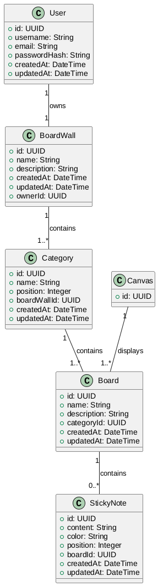
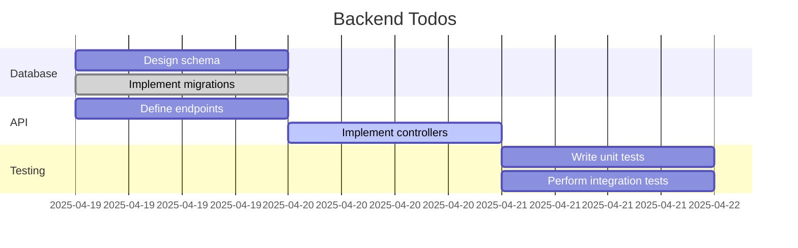

# Boardwall Backend

Type: `Springboot Application - Java 17, jar file`

1. DB: `Postgres`
2. JDBC DB driver: `postgres-driver`
3. PORT: `8001`

## Design

## Todos in Gantt

## Continue:

1. Category
2. StickyNote